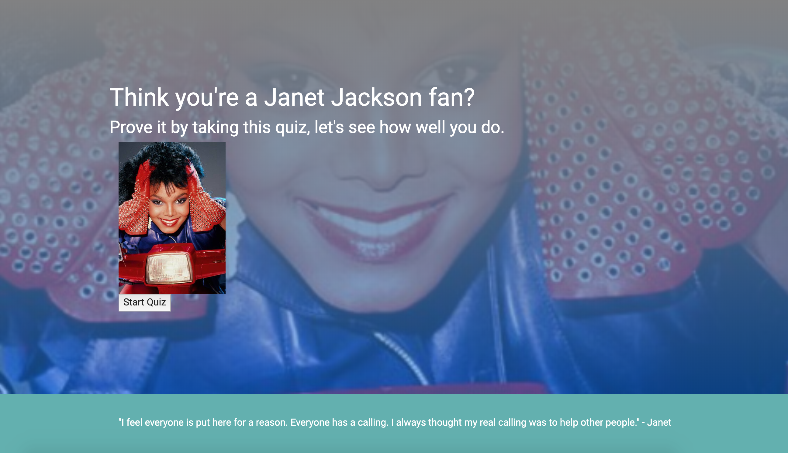

# QUIZ APP

## USER STORY

- I am the ultimate Janet Jackson fan
- I want to prove it
- I don't have all day to prove it, so it needs to be limited in time

## Screenshot

## App
![Link to app] (http://yarrrjun.github.io/homework-4)

<!-- Notes to self:

Strategy

0- Create a landing page for the quiz itself (include quiz name, subject, welcome, must be responsive)
Click event to start quiz (button, start quiz)

H1, image, bg image, H1 quiz name, welcome

1-  New "page" loads
    First set of questions load
    Timer is counting down
    Submit button

.ready(), ordered list of buttons, correct onclick increases time to timer, incorrect button decreases time from timer

2-  Timer increases or decreases
    New "page" loads with new questions
    Time is counting down
    Submit button

.ready(), ordered list of buttons, correct onclick increases time to timer, incorrect button decreases time from timer

3-  Timer increases or decreases
    New "page" loads with new questions
    Time is counting down
    Submit button

.ready(), ordered list of buttons, correct onclick increases time to timer, incorrect button decreases time from timer

4-  Timer increases or decreases
    New "page" loads with new questions
    Time is counting down
    Submit button

.ready(), ordered list of buttons, correct onclick increases time to timer, incorrect button decreases time from timer

5-  Timer increases or decreases
    New "page" loads with new questions
    Time is counting down
    Submit button

.ready(), ordered list of buttons, correct onclick increases time to timer, incorrect button decreases time from timer

6- Score displayed using timer value, with image

.onClick () is how we add an event listener
.ready() is how we load information after the page loads

"this" is your representation of the scope of the object

NEED HELP WITH
-How do I assign values to each button?
-How do I get the counter to work with each button?

 -->
